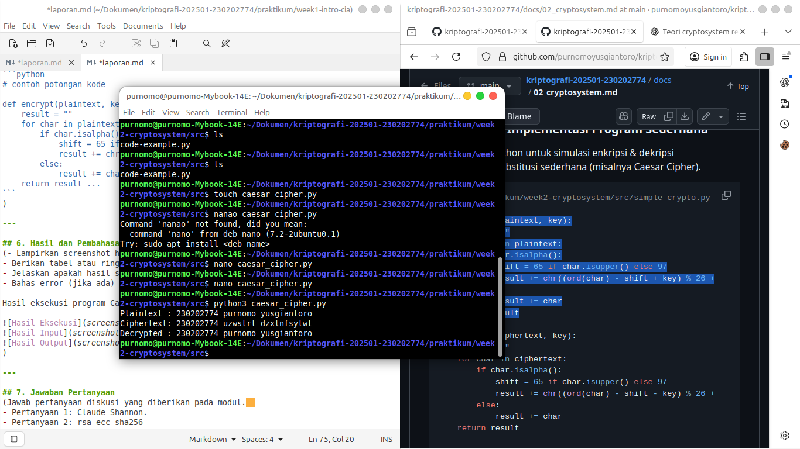

# Laporan Praktikum Kriptografi
Minggu ke-: 1 
Topik: sejarah kriptograpi  
Nama: purnomo yusgiantoro  
NIM: 230202774  
Kelas: 5ikra  

---

## 1. Tujuan

Menjelaskan sejarah dan evolusi kriptografi dari masa klasik hingga modern.
Menyebutkan prinsip Confidentiality, Integrity, Availability (CIA) dengan benar.
Menyimpulkan peran kriptografi dalam sistem keamanan informasi modern.
Menyiapkan repositori GitHub sebagai media kerja praktikum.


---

## 2. Dasar Teori
Kriptografi merupakan ilmu dan seni untuk menjaga kerahasiaan informasi dengan cara mengubah pesan asli (plaintext) menjadi bentuk yang tidak dapat dibaca (ciphertext). Dalam perkembangannya, kriptografi terbagi menjadi dua era utama, yaitu kriptografi klasik dan kriptografi modern. Kriptografi klasik menggunakan teknik penyandian sederhana seperti substitution cipher dan transposition cipher, contohnya Caesar Cipher dan Vigenère Cipher. Sistem ini hanya mengandalkan satu kunci yang sama untuk proses enkripsi dan dekripsi.

Konsep penting dalam kriptografi adalah modular aritmetika, yaitu operasi matematika dengan sistem bilangan yang “berulang” setelah mencapai batas tertentu (modulus). Misalnya, dalam sistem modulo 26 (huruf alfabet), hasil penjumlahan 25 + 3 ≡ 2 (mod 26). Prinsip ini digunakan untuk mengubah huruf atau angka menjadi sandi dan merupakan dasar bagi algoritma seperti RSA dan Diffie–Hellman.

Kriptografi modern kemudian berkembang dengan menggunakan konsep matematika kompleks dan teori kunci publik, yang memungkinkan dua pihak berkomunikasi secara aman tanpa perlu berbagi kunci rahasia terlebih dahulu. Sistem seperti RSA dan Elliptic Curve Cryptography (ECC) memanfaatkan operasi matematika seperti eksponensial modular dan kurva eliptik untuk menjaga keamanan data di dunia digital.

---

## 3. Alat dan Bahan
(- Python 3.x  
- Visual Studio Code / editor lain  
- Git dan akun GitHub  
- Library tambahan (misalnya pycryptodome, jika diperlukan)  )

---

## 4. Langkah Percobaan
(Tuliskan langkah yang dilakukan sesuai instruksi.  
Contoh format:
1. Membuat file `caesar_cipher.py` di folder `praktikum/week2-cryptosystem/src/`.
2. Menyalin kode program dari panduan praktikum.
3. Menjalankan program dengan perintah `python caesar_cipher.py`.)

---

## 5. Source Code
(Salin kode program utama yang dibuat atau dimodifikasi.  
Gunakan blok kode:

```python
# contoh potongan kode
def encrypt(text, key):
    return ...
```
)

---

## 6. Hasil dan Pembahasan
(- Lampirkan screenshot hasil eksekusi program (taruh di folder `screenshots/`).  
- Berikan tabel atau ringkasan hasil uji jika diperlukan.  
- Jelaskan apakah hasil sesuai ekspektasi.  
- Bahas error (jika ada) dan solusinya. 

Hasil eksekusi program Caesar Cipher:




)

---

## 7. Jawaban Pertanyaan
(Jawab pertanyaan diskusi yang diberikan pada modul.  
- Pertanyaan 1: Claude Shannon.
- Pertanyaan 2: rsa ecc sha256
- Pertanyaan 3: Kriptografi klasik menggunakan satu kunci yang sama (simetris) untuk enkripsi dan dekripsi, serta diterapkan pada pesan teks manual seperti pada Caesar Cipher dan Vigenère Cipher. Sistem ini mudah dipecahkan karena masih bergantung pada pola huruf dan analisis frekuensi.
Sebaliknya, kriptografi modern menggunakan dua kunci berbeda (asimetris), yaitu kunci publik dan privat, serta diterapkan dalam sistem komputer dan jaringan digital. Contohnya adalah algoritma AES, RSA, dan ECC, yang mengandalkan konsep matematika kompleks untuk menghasilkan keamanan yang jauh lebih kuat dibandingkan metode klasik.

)
---

## 8. Kesimpulan
(Tuliskan kesimpulan singkat (2–3 kalimat) berdasarkan percobaan.  )

---

## 9. Daftar Pustaka
(Cantumkan referensi yang digunakan.  
Contoh:  
- Katz, J., & Lindell, Y. *Introduction to Modern Cryptography*.  
- Stallings, W. *Cryptography and Network Security*.  )

---

## 10. Commit Log
(Tuliskan bukti commit Git yang relevan.  
Contoh:
```
Merge: 638f5a4 e0c6fe5
Author: purnomo <purnomo@purnomo-Mybook-14E>
Date:   Fri Oct 10 16:18:15 2025 +0700

    Merge remote-tracking branch 'upstream/main'

```
