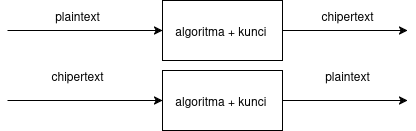

# Laporan Praktikum Kriptografi
Minggu ke-: 2  
Topik: Cryptosystem (Komponen, Enkripsi & Dekripsi, Simetris & Asimetris)  
Nama: purnomo yusgiantoro  
NIM: 230202774  
Kelas: 5ikra  

---

## 1. Tujuan

1. Mengidentifikasi komponen dasar kriptosistem (plaintext, ciphertext, kunci,      algoritma).
2. Menggambarkan proses enkripsi dan dekripsi sederhana.
3. Mengklasifikasikan jenis kriptosistem (simetris dan asimetris).


---

## 2. Dasar Teori
Cryptosystem adalah sistem kriptografi yang digunakan untuk melindungi data melalui proses enkripsi (mengubah pesan asli menjadi kode rahasia) dan dekripsi (mengembalikannya ke bentuk semula). Komponen utamanya meliputi plaintext, ciphertext, algoritma enkripsi-dekripsi, dan key sebagai kunci pengaman.

Terdapat dua jenis utama cryptosystem: simetris dan asimetris. Pada sistem simetris, kunci enkripsi dan dekripsi sama, sedangkan pada sistem asimetris digunakan dua kunci berbeda — public key dan private key. Umumnya, sistem simetris lebih cepat, sementara sistem asimetris lebih aman dalam distribusi kunci.


---

## 3. Alat dan Bahan
(- Python 3.x  
- Visual Studio Code / editor lain  
- Git dan akun GitHub  
- Library tambahan (misalnya pycryptodome, jika diperlukan)  )

---

## 4. Langkah Percobaan
(Tuliskan langkah yang dilakukan sesuai instruksi.  
Contoh format:
1. Membuat file `caesar_cipher.py` di folder `praktikum/week2-cryptosystem/src/`.
2. Menyalin kode program dari panduan praktikum.
3. Menjalankan program dengan perintah `python caesar_cipher.py`.)

---

## 5. Source Code
(Salin kode program utama yang dibuat atau dimodifikasi.  
Gunakan blok kode:

```def caesar_encrypt(text, key):
    shift = key % 26
    res = []
    for ch in text:
        if 'a' <= ch <= 'z':
            res.append(chr((ord(ch) - 97 + shift) % 26 + 97))
        elif 'A' <= ch <= 'Z':
            res.append(chr((ord(ch) - 65 + shift) % 26 + 65))
        else:
            res.append(ch)
    return "".join(res) ...
```
)

---

## 6. Hasil dan Pembahasan


---

## 7. Jawaban Pertanyaan
(Jawab pertanyaan diskusi yang diberikan pada modul.  
- Pertanyaan 1: plaintext , ciphertext, algoritma, key  
- Pertanyaan 2: kelebihan : proses enkripsi dan dekripsi lebih cepat serta efisien dalam penggunaan sumber daya 
kekurangan : distribusi kunci kurang aman karena pengirim dan penerima harus memiliki kunci yang sama, sehingga rawan disadap.    
- Pertanyaan 3: Distribusi kunci menjadi masalah utama karena kunci yang sama harus dikirimkan ke pihak lain melalui saluran komunikasi. Jika kunci tersebut bocor atau disadap oleh pihak ketiga, maka seluruh sistem keamanan pesan akan terancam.  
)


---

## 8. Kesimpulan
(Tuliskan kesimpulan singkat (2–3 kalimat) berdasarkan percobaan.  )

---

## 9. Daftar Pustaka
(Cantumkan referensi yang digunakan.  
Contoh:  
- Katz, J., & Lindell, Y. *Introduction to Modern Cryptography*.  
- Stallings, W. *Cryptography and Network Security*.  )

---

## 10. Commit Log
(Tuliskan bukti commit Git yang relevan.  
Contoh:
```
commit 2ea82d85ecdc19fd26966a62142c275a98578603
Author: purnomo <purnomo@purnomo-Mybook-14E>
Date:   Sat Oct 11 16:17:18 2025 +0700

    week2-cryptosystem
```
